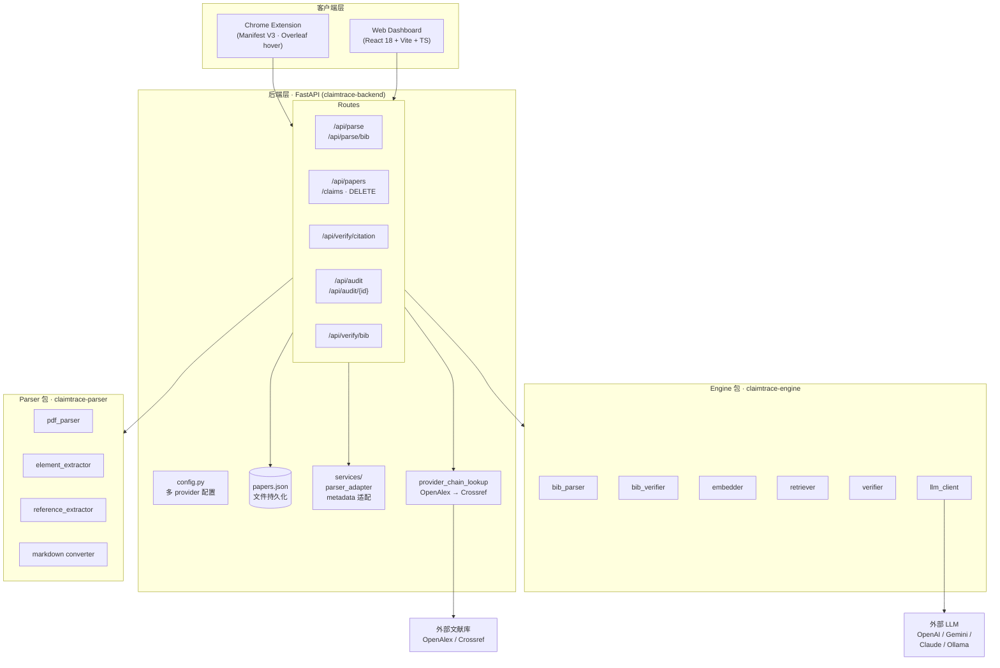
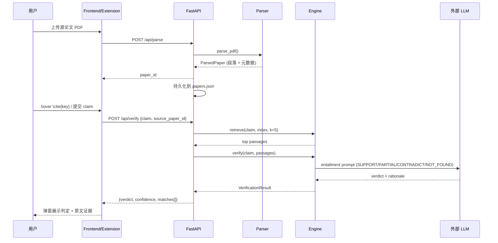
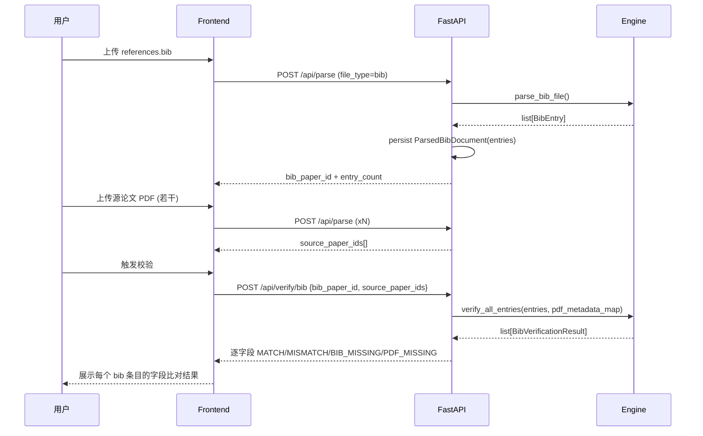

# ClaimTrace Architecture

> Last updated: 2026-09-21 | v0.3  
> 反映当前真实代码结构（**四组**：Backend / Frontend / Parser / Engine —— 见 [team.md](team.md)）。  
> v0.2 → v0.3 变更：Audit 从语义批量判定改为**文献元数据核对**（外部查询已接 OpenAlex + Crossref
> provider 链）、前端已迁移到 v2 契约、补全 API 端点表、§6 缺口表按代码逐行重核。  
> ⚠️ 本文曾长期**低报完成度**：§6 原有 6 行缺口中有 4 行早已关闭。凡写「未实现」前请先打开文件。

---

## 1. 系统分层图



**关键边界**：
- `Backend ↔ Engine/Parser` 是 **Python 包 import**（同进程），不是 REST —— 避免重复造 API。
- `Backend ↔ Frontend/Extension` 是 **REST `/api/*`**。
- `Backend ↔ 外部 LLM` 与 `Backend ↔ 外部文献库（OpenAlex / Crossref）` 是另外两条出网边界。
  两者都是**可失败**的：查询失败必须表现为 `LOOKUP_FAILED`，绝不能退化成 `NOT_FOUND`
  （见 [audit-contract.md](audit-contract.md)）。这是全系统最重要的一条不变量。
- `papers.json` 是文件持久化，**不是数据库**（见 §5 设计决策）。

---

## 2. 数据流

### 2.1 引用验证流程（claim → verdict）



### 2.2 bib 元数据校验流程



### 2.3 Single Verify claims / bibliography Audit

Single Verify reads persisted Parser paragraphs through
`GET /api/papers/{paper_id}/claims`. Claim text and page locations remain available.
Local source association is not external publication verification.

Bibliography Audit reads persisted Bib entries or calls the existing PDF reference
extractor, then delegates publication lookup to an external-record adapter and
compares metadata through the existing Engine comparator. It never ranks source
passages or classifies claim support. Startup installs a real provider chain —
**OpenAlex (primary), then Crossref** — into `app.state.bibliography_lookup`;
`EXTERNAL_LOOKUP_NOT_CONFIGURED` remains only as the `lookup is None` fallback.
A reference carries two descriptions of itself — the structured fields a parser
filled in, and its raw text — and which one is complete depends on how the paper was
loaded. The searchability guard, the lookup and the field comparison therefore all
read the same one, through `reference_query_for`, so the audit cannot search on one
description and compare against another. This is not a tidiness rule: when the guard
read the structured title and the comparison read the raw text, every one of the 174
PDF references was bounced before lookup ever ran.
See [the Audit contract](audit-contract.md) for the full v2 schema, the lookup rules
and the measured limits.

---

## 3. API 契约

### 端点总览

| 端点 | 方法 | 用途 |
|------|------|------|
| `/health` | GET | 健康检查 |
| `/api/parse` | POST | 上传 PDF / .bib，返回 `paper_id` |
| `/api/parse/bib` | POST | 重新解析并返回已保存的 BibTeX 条目 |
| `/api/parse/{paper_id}` | GET | 查询解析状态 |
| `/api/parse/{paper_id}` | PUT | 覆盖已同步 BibTeX 的内容，保留同一 Library 记录 |
| `/api/papers` | GET | 列出论文库 |
| `/api/papers/{paper_id}` | DELETE | 永久删除一条 Library 记录及其产物（204 / 202 / 404 / 500） |
| `/api/papers/{paper_id}/claims` | GET | 从持久化 manuscript 中提取 claims/citation markers |
| `/api/verify` | POST | 旧版单条 claim 验证；**仓库内已无调用方** |
| `/api/verify/citation` | POST | 单条 claim 验证 + 引用定位（网页 Review 页实际调用） |
| `/api/verify/bib` | POST | 本地交叉校验 bib 元数据 × 用户上传的 PDF（不联网） |
| `/api/audit` | POST | 文献元数据核对（Audit v2，`contract_version: 2`） |
| `/api/audit/{audit_id}` | GET | 读取已保存的 Audit 结果 |

### POST /api/parse

```
Request:  multipart/form-data { file: PDF | .bib }
Response: { paper_id, status, file_type, pages, paragraph_count, entry_count, title? }
```

### POST /api/parse/bib

```
Request:  { paper_id: str }
Response: {
  paper_id, status, file_type: "bib", entry_count,
  entries: [{ key, entry_type, title, authors, year, venue, ... }]
}
```

The endpoint re-runs the real Engine parser for the uploaded `.bib` file and
returns the entries read back from the persisted `ParsedBibDocument`. It does
not return placeholder or hardcoded bibliography data.

### POST /api/verify

```
Request:  { claim: str, source_paper_id: str }
Response: {
  claim, verdict, confidence, rationale,
  matches: [{ passage_text, similarity, entailment_label, confidence }]
}
```

**Legacy endpoint — no client in this repository.** The Review page uses
`POST /api/verify/citation` instead, and the extension calls no Verify endpoint.
Kept for contract stability; new integrations should use `/api/verify/citation`.

`verdict` is one of the four judgements, never a stand-in for "not judged". When a
configured LLM declines to judge (`NO_EVIDENCE`, `MODEL_ERROR`, `INVALID_LABEL`,
`INVALID_RESPONSE`), the endpoint answers **503** with
`{ "detail": { "code": <VerificationStatus>, "message": <rationale> } }` — there is no slot
for that outcome in the response above, and `NOT_FOUND` is itself a verdict, so reporting
one would invent a finding. The only 200 response without an LLM is the announced lexical
baseline, which is used when no client is configured at all. See
`engine-verify-contract.zh-CN.md` §6.2.

### POST /api/audit

```text
Request: { bib_paper_id: str } OR { manuscript_id: str }
Response: {
  contract_version: 2, audit_id, input_paper_id, input_type, checked_at,
  status, total_entries, counts, warnings,
  results: [{ entry, status, reason, field_checks,
              matched_record, candidates, lookup_attempts }]
}
```

Source PDFs are not required. Results distinguish `VERIFIED`,
`METADATA_MISMATCH`, `NEEDS_REVIEW`, `NOT_FOUND`, and `LOOKUP_FAILED`.
`NOT_FOUND` does not prove fabrication. `GET /api/audit/{audit_id}` reads stored
results. See `backend/src/audit_models.py` and
[the Audit contract](audit-contract.md) for the full v2 schema and the lookup rules.
The web frontend has migrated: `AuditPage` renders all five states, and
`frontend/src/api/client.ts` rejects any response whose `contract_version` is not 2.

### GET /api/papers/{id}/claims

```text
Response: {
  manuscript_id, status, error_message?, manuscript_document?,
  claims: [{ claim_id, text, page, citation_marker,
    resolution_status, cited_source?, similar_sources?,
    source_document?, manuscript_location? }]
}
```

The endpoint reads the JSON produced by the PDF Parser pipeline. It extracts
LaTeX, numeric, and author-year citation markers from manuscript sentences,
skips the references section, and assigns stable page/paragraph locations.
When a persisted BibTeX record and a matching uploaded source PDF are
available, the response also includes the resolved local source metadata.

### POST /api/verify/bib

```
Request:  { bib_paper_id: str, source_paper_ids: [str] }
Response: {
  bib_paper_id, total_entries, matched_entries, error_entries,
  results: [{
    citation_key, has_errors, error_count, warning_count, summary,
    fields: [{ field_name, bib_value, pdf_value, status, detail }]
  }]
}
```

完整模型见 `backend/src/models.py`；交互式文档见 `http://localhost:8000/docs`。

---

## 4. 技术栈

| 层 | 技术 | 说明 |
|----|------|------|
| PDF 解析 | PyMuPDF (fitz) | 文本位置提取最准 |
| 表格提取 | pdfplumber | 可靠表格检测 |
| 公式识别 | Nougat / Pix2Text（可选） | OCR-free LaTeX 还原 |
| Markdown 转换 | 自研 converter | PDF → Markdown（parser 模块） |
| BibTeX 解析 | 自研 `bib_parser` | 支持 @string/# 拼接/LaTeX 转义 |
| Embeddings | sentence-transformers (all-MiniLM-L6-v2) | 本地、快、语义质量好 |
| 向量索引 | FAISS (IndexFlatIP) | 内存、余弦相似度 |
| LLM 验证 | GPT-4o / Gemini 2.0 Flash / Claude / Ollama | 多 provider，通过 `llm_client` 工厂统一 |
| 后端 | FastAPI + Uvicorn | 异步、自动文档、Pydantic 校验 |
| 持久化 | `papers.json`（文件） | 见 §5，不引数据库 |
| 前端 | React 18 + Vite + TypeScript | 快速开发、类型安全 |
| 扩展 | Chrome Manifest V3 | 当前标准 |
| CI/CD | GitHub Actions | 免费 |

---

## 5. 关键设计决策

### 1. 文件持久化而非数据库
`papers.json` + 文件存储替代 Postgres/MySQL。理由：数据量小（几篇到几十篇论文）、无多用户并发、无复杂查询。省下的时间投入 PDF 解析和检索准确率。若后续需要查询/多用户，SQLite 是零成本升级路径。

### 2. 多 Provider LLM 抽象
`llm_client.build_llm_client()` 工厂把 OpenAI/Gemini/Claude/Ollama 统一成 OpenAI 兼容接口。所有 provider 讲同一种协议，上层代码无感知切换。语义分类仅属于单条 Verify。文献 Audit 不使用 LLM 支持度分类，其外部记录查询适配器仍待接入。

### 3. 两阶段检索（Paragraph → Sentence）
段落级 embedding 保证召回，句子级重排保证精度。避免纯句子切分（噪声大）和纯段落切分（精度低）各自的缺陷。

### 4. 展示证据而非只给结论
单条 Verify 的信任设计：每条语义判定都**附带匹配到的原文段落**，用户能自己判断 AI 对不对。LLM 只做「给定原文 + claim 的支撑关系分类」，不凭记忆生成引用——这正是防御「LLM 幻觉」的关键（见 pitch Q&A）。

### 5. 目录级所有权（Monorepo）
`frontend/`、`backend/`、`engine/`、`parser/` 各自独立成包，跨模块通过类型化 API 契约交互，而非共享代码。每队只改自己的目录，从源头消除 Git 冲突。

---

## 6. 当前缺口（截至 v0.3，逐行对代码复核）

| 缺口 | 影响 | 归属 |
|------|------|------|
| `ParsedPaper` 首页 `title` / `authors` 从不填充（`parser/parser/pdf_parser.py:38` 有字段，`:231` 构造时不传），且**根本没有** `year` / `venue` / `doi` 字段 | 元数据实际由 `parser_adapter.py` 的一页文本兜底提供，该兜底无人负责确认或替换 | **Parser** |
| `frontend/src/api/client.ts:88` 的 `deletePaper` 只接受 204 | 202 `cleanup_pending` 时抛「无法确认删除」，而记录其实已删除；用户看到条目仍在 | **Frontend** |
| 引用列表只识别到 174 条中 1 条的结构化 `title` | Audit 因此读 raw text，并需要「raw text 恢复值不指控」这条规则 | **Parser** |
| Parser 拒绝只有一条引用的 reference section（需 ≥ 2 条） | 单条引用的样例 PDF 返回空列表 + 警告，属既定边界 | **Parser** |
| Verify / Audit 均不接受手动指定来源 PDF，候选记录仅供参考 | 歧义来源只能停在不判定状态 | **Backend + Frontend** |
| 成功指标 4（Parser Recall@5 ≥ 0.80）与 5（Entailment accuracy ≥ 85%） | 仪表已建好，`claim_passages.json` 仍为空——缺的是标注而非工具 | **Parser / Engine**，见 [team.md](team.md) §2 |

### v0.3 已关闭（原 §6 的记录是错的）

本节原先列出 6 行缺口，其中 4 行**在写下时就已经关闭**。记录在此，避免同样的说法回流：

| 原说法 | 实际 |
|------|------|
| 前端默认 mock（`VITE_USE_MOCK_API=true`） | `client.ts` 判的是 `=== "true"`，`.env.example` 是 `false`——未设置即走真实后端，这个前提从来不成立 |
| Audit 外部记录查询未实现 | `backend/src/main.py` 启动时装载 `ProviderChainLookup`（OpenAlex → Crossref）；`EXTERNAL_LOOKUP_NOT_CONFIGURED` 只剩 `lookup is None` 的兜底 |
| Audit 前端仍使用旧语义契约 | `AuditPage` 五状态齐全，`client.ts:204` 硬拒非 v2 响应 |
| PDF 参考文献抽取仅返回原始文本 | 结构化字段已由 Parser 产出，问题是它们在该语料上近乎全空（174 条中 1 条）——解决方式因此是读 raw text，而不是补字段 |
| markdown converter 测试产物误提交 | 已删除产物并加入 `.gitignore`；注意 `markdown_converter.py` 每次运行都会清空该目录，产物本就无法长期留存 |

### User Story → 架构元素映射

编号对应 [docs/user-research/user-stories.md](user-research/user-stories.md)。US-05 已按现行
Audit（文献核对）而非已删除的语义批量审计修订。

| User Story | Context 涉及 | Container 路径 | Component 路径 |
|-----------|-------------|---------------|---------------|
| US-01 上传解析 PDF | 研究者 → ClaimTrace | Dashboard → API → Parser 包 → Storage | Routes → Pipeline → Parser Adapter → Storage |
| US-02 hover 验证 | 研究者 → Overleaf → ClaimTrace | Extension → Overleaf / API → Engine | Routes → Verify Svc → Engine Adapter |
| US-03 claim 判定 | ClaimTrace → 外部 LLM | API → Engine 包 → LLM | Routes → Verify Svc → Engine Adapter → LLM |
| US-04 bib 本地校验 | 研究者 → ClaimTrace | API → Engine 包 | Routes → Bib Svc / Bib Verify Svc → Engine Adapter |
| US-05 文献元数据核对 | 研究者 → ClaimTrace → OpenAlex / Crossref | Dashboard → API → 外部文献库 → Engine 包 | Routes → Audit Svc → Lookup Adapter（provider 链）→ Engine comparator |
| US-06 看证据 | — | Engine 包（retriever）；Audit 侧为外部记录 URL | Engine Adapter → Engine 包；Audit 为 matched_record |
| US-07 论文库 | 研究者 → ClaimTrace | Dashboard → API → Storage | Routes → Storage |
| US-08 审稿人核查 | 审稿人 → ClaimTrace | Dashboard → API → Parser/Engine | 复用 US-01 + US-05 |
| US-09 导出报告 | 研究者 → ClaimTrace | Dashboard（前端生成） | — |
| US-10 团队共享 | — | Storage（多用户，**P2 未实现**） | — |

信任边界在 C4 语义下体现为：Context 层的「ClaimTrace ↔ 外部 LLM」与
「ClaimTrace ↔ 外部文献库」，Container 层的「客户端 ↔ 后端（网络）」与「后端 ↔ 文件系统（本地）」。
粒度到 Component 层即可，不再下探到代码层。
