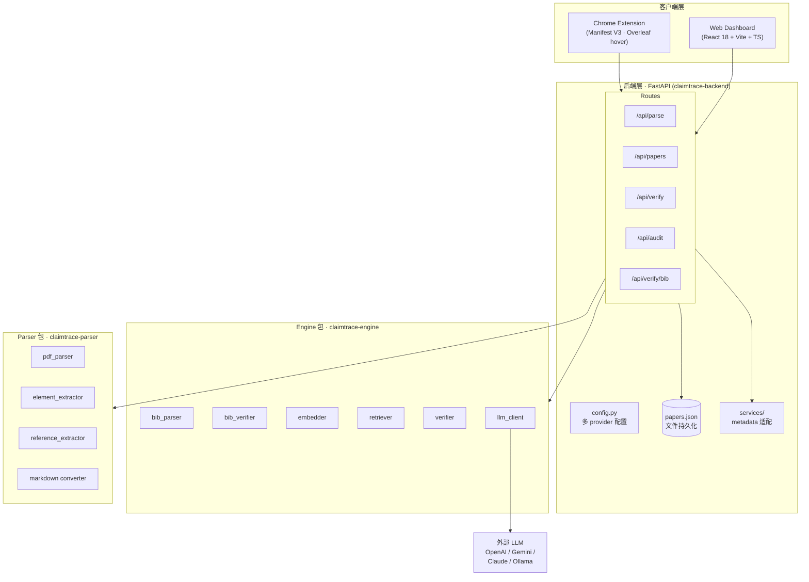
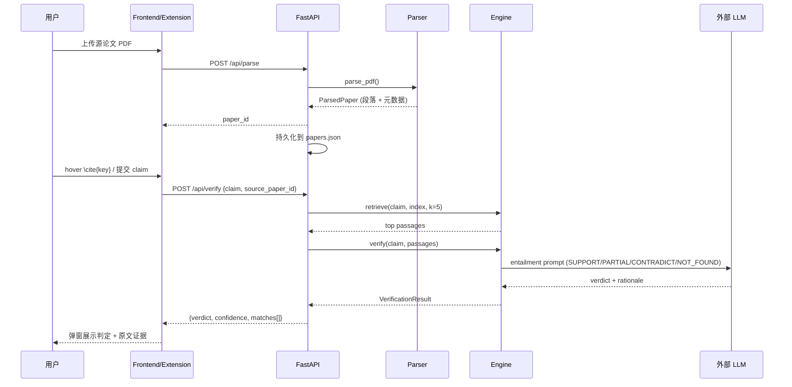
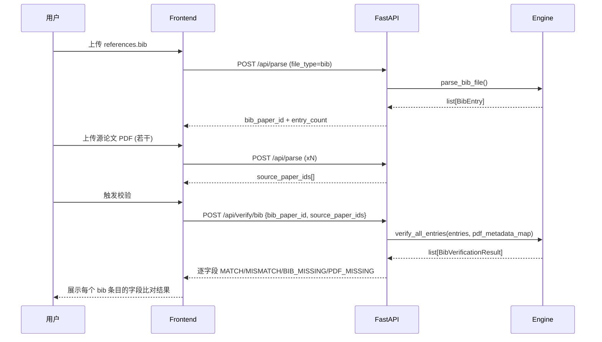

# ClaimTrace Architecture

> Last updated: 2026-08-28 | v0.2  
> 反映当前真实代码结构（三队：Frontend / Backend / Engine+Parser）。  
> v0.1 → v0.2 变更：团队结构从 Pair 改为三队、新增 bib 验证、papers.json 持久化、markdown converter、多 provider LLM。

---

## 1. 系统分层图



**关键边界**：
- `Backend ↔ Engine/Parser` 是 **Python 包 import**（同进程），不是 REST —— 避免重复造 API。
- `Backend ↔ Frontend/Extension` 是 **REST `/api/*`**，这是唯一真正的网络边界。
- `papers.json` 是文件持久化，**不是数据库**（见 §5 设计决策）。

---

## 2. 数据流

### 2.1 引用验证流程（claim → verdict）



### 2.2 bib 元数据校验流程



---

## 3. API 契约

### 端点总览

| 端点 | 方法 | 用途 |
|------|------|------|
| `/health` | GET | 健康检查 |
| `/api/parse` | POST | 上传 PDF / .bib，返回 `paper_id` |
| `/api/parse/{id}` | GET | 查询解析状态 |
| `/api/papers` | GET | 列出论文库 |
| `/api/verify` | POST | 验证单条 claim |
| `/api/audit` | POST | 批量审计 |
| `/api/verify/bib` | POST | 交叉校验 bib 元数据 |

### POST /api/parse

```
Request:  multipart/form-data { file: PDF | .bib }
Response: { paper_id, status, file_type, pages, paragraph_count, entry_count, title? }
```

### POST /api/verify

```
Request:  { claim: str, source_paper_id: str }
Response: {
  claim, verdict, confidence, rationale,
  matches: [{ passage_text, similarity, entailment_label, confidence }]
}
```

### POST /api/audit

```
Request:  { manuscript_id: str, source_paper_ids: [str] }
Response: {
  manuscript_id, total_citations, supported, partial,
  contradicted, not_found,
  results: [{ citation_key, claim, verdict, confidence, risk_level }]
}
```

### POST /api/verify/bib

```
Request:  { bib_paper_id: str, source_paper_ids: [str] }
Response: {
  bib_paper_id, total_entries, matched_entries, error_entries,
  results: [{
    citation_key, has_errors, error_count, warning_count, summary,
    fields: [{ field_name, bib_value, pdf_value, status, detail }]
  }]
}
```

完整模型见 `backend/src/models.py`；交互式文档见 `http://localhost:8000/docs`。

---

## 4. 技术栈

| 层 | 技术 | 说明 |
|----|------|------|
| PDF 解析 | PyMuPDF (fitz) | 文本位置提取最准 |
| 表格提取 | pdfplumber | 可靠表格检测 |
| 公式识别 | Nougat / Pix2Text（可选） | OCR-free LaTeX 还原 |
| Markdown 转换 | 自研 converter | PDF → Markdown（parser 模块） |
| BibTeX 解析 | 自研 `bib_parser` | 支持 @string/# 拼接/LaTeX 转义 |
| Embeddings | sentence-transformers (all-MiniLM-L6-v2) | 本地、快、语义质量好 |
| 向量索引 | FAISS (IndexFlatIP) | 内存、余弦相似度 |
| LLM 验证 | GPT-4o / Gemini 2.0 Flash / Claude / Ollama | 多 provider，通过 `llm_client` 工厂统一 |
| 后端 | FastAPI + Uvicorn | 异步、自动文档、Pydantic 校验 |
| 持久化 | `papers.json`（文件） | 见 §5，不引数据库 |
| 前端 | React 18 + Vite + TypeScript | 快速开发、类型安全 |
| 扩展 | Chrome Manifest V3 | 当前标准 |
| CI/CD | GitHub Actions | 免费 |

---

## 5. 关键设计决策

### 1. 文件持久化而非数据库
`papers.json` + 文件存储替代 Postgres/MySQL。理由：数据量小（几篇到几十篇论文）、无多用户并发、无复杂查询。省下的时间投入 PDF 解析和检索准确率。若后续需要查询/多用户，SQLite 是零成本升级路径。

### 2. 多 Provider LLM 抽象
`llm_client.build_llm_client()` 工厂把 OpenAI/Gemini/Claude/Ollama 统一成 OpenAI 兼容接口。所有 provider 讲同一种协议，上层代码无感知切换。未配置 key 时自动降级为 **mock mode**（返回 NOT_FOUND），保证 CI 和本地开发能跑。

### 3. 两阶段检索（Paragraph → Sentence）
段落级 embedding 保证召回，句子级重排保证精度。避免纯句子切分（噪声大）和纯段落切分（精度低）各自的缺陷。

### 4. 展示证据而非只给结论
核心信任设计：每条判定都**附带匹配到的原文段落**，用户能自己判断 AI 对不对。LLM 只做「给定原文 + claim 的支撑关系分类」，不凭记忆生成引用——这正是防御「LLM 幻觉」的关键（见 pitch Q&A）。

### 5. 目录级所有权（Monorepo）
`frontend/`、`backend/`、`engine/`、`parser/` 各自独立成包，跨模块通过类型化 API 契约交互，而非共享代码。每队只改自己的目录，从源头消除 Git 冲突。

---

## 6. 当前缺口（截至 v0.2）

| 缺口 | 影响 | 归属 |
|------|------|------|
| `ParsedPaper` 首页元数据未填充 | bib 验证暂时只能返回 `PDF_MISSING` | Parser 队 |
| 前端默认 mock（`VITE_USE_MOCK_API=true`） | 端到端未完全串真实后端 | Frontend |
| markdown converter 测试产物误提交 | git 卫生问题（暂不处理） | 全员 |
