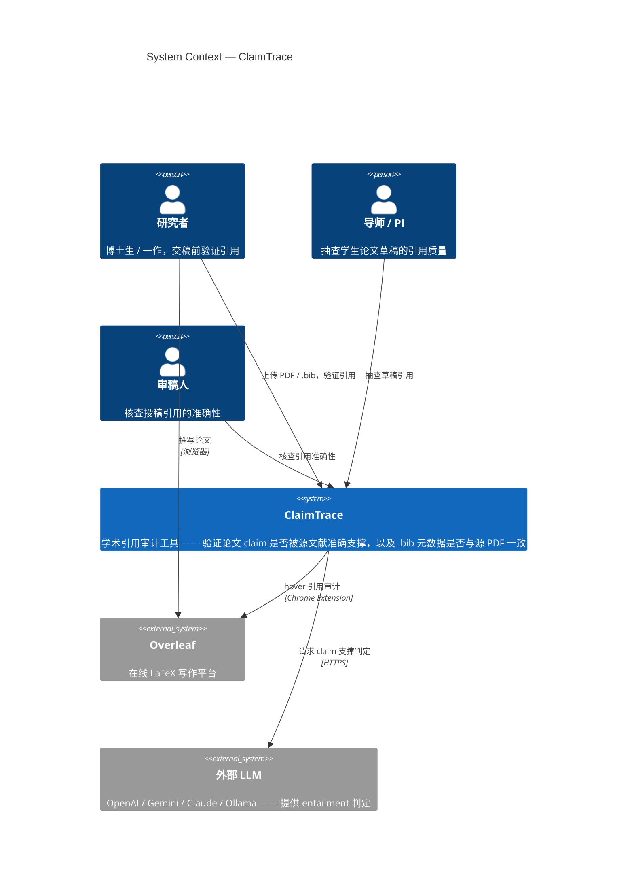
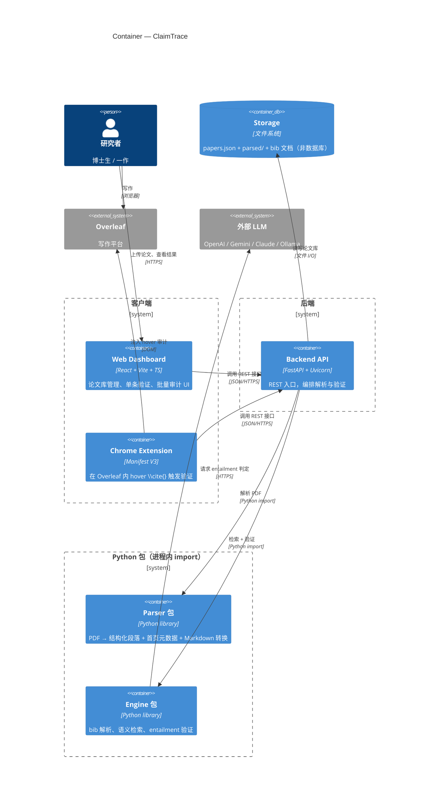
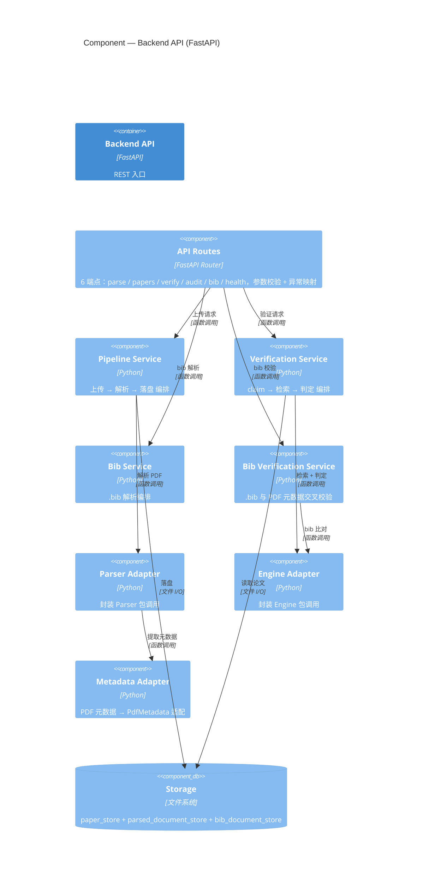

# C4 Model — ClaimTrace

> 基于 [user-stories.md](user-research/user-stories.md) 的 10 个 user story 生成，反映当前代码结构。  
> C4 模型（Simon Brown）分四层：System Context → Container → Component → Code。本文覆盖前三层（Code 层略）。  
> 图用 Mermaid C4 语法（需 Mermaid ≥ 9.4，GitHub 原生渲染）。

---

## Level 1: System Context（系统上下文）

### 元素清单

| 元素 | 类型 | 说明 | 关联 User Story |
|------|------|------|----------------|
| 研究者 | Person | 主要用户，交稿前验证引用 | US-01/02/03/04/05/07 |
| 导师 / PI | Person | 抽查学生草稿 | US-05/06 |
| 审稿人 | Person | 核查投稿引用 | US-03/06/08 |
| ClaimTrace | System | 引用审计工具本体 | 全部 |
| Overleaf | External System | 写作平台，扩展嵌入点 | US-02 |
| 外部 LLM | External System | 语义判定能力 | US-03 |

**信任边界**：ClaimTrace 与外部 LLM 之间只发送 claim + 匹配段落（不含论文全文），是隐私边界。

---

## Level 2: Container（容器）

### 元素清单

| 容器 | 技术 | 职责 | 关联 User Story |
|------|------|------|----------------|
| Web Dashboard | React + Vite + TS | 论文库、单条验证、批量审计 | US-01/03/05/07/09 |
| Chrome Extension | Manifest V3 | Overleaf hover 审计 | US-02 |
| Backend API | FastAPI | 编排、异常映射、持久化 | US-01/03/04/05/07 |
| Parser 包 | Python | PDF 解析 + 元数据 + Markdown | US-01 |
| Engine 包 | Python | bib 解析 + 检索 + 验证 | US-03/04/06 |
| Storage | 文件系统 | papers.json + parsed/ + bib | US-07 |

**关键决策**：Backend API 与 Parser/Engine 包之间是 **Python import**（同进程），不是网络调用——只有 Backend API ↔ 客户端、Engine ↔ 外部 LLM 是网络边界。

---

## Level 3: Component（组件 — Backend API 容器内部）

### 元素清单

| 组件 | 职责 | 支撑 User Story |
|------|------|----------------|
| API Routes | 6 端点入口，异常映射 4xx/5xx | 全部 |
| Pipeline Service | 上传 → 解析 → 落盘 | US-01/07 |
| Verification Service | claim 验证编排 | US-03/05 |
| Bib Service | .bib 解析编排 | US-04 |
| Bib Verification Service | .bib ↔ PDF 元数据比对 | US-04 |
| Parser Adapter | 封装 Parser 包 | US-01 |
| Engine Adapter | 封装 Engine 包 | US-03/04 |
| Metadata Adapter | 元数据适配 | US-04 |
| Storage | 3 个 store 持久化 | US-07 |

---

## 附：User Story → 架构元素完整映射

| User Story | Context 涉及 | Container 路径 | Component 路径 |
|-----------|-------------|---------------|---------------|
| US-01 上传解析 PDF | 研究者 → ClaimTrace | Dashboard → API → Parser 包 → Storage | Routes → Pipeline → Parser Adapter → Storage |
| US-02 hover 验证 | 研究者 → Overleaf → ClaimTrace | Extension → Overleaf / API → Engine | Routes → Verify Svc → Engine Adapter |
| US-03 claim 判定 | ClaimTrace → 外部 LLM | API → Engine 包 → LLM | Routes → Verify Svc → Engine Adapter → LLM |
| US-04 bib 校验 | 研究者 → ClaimTrace | API → Engine 包 | Routes → Bib Svc / Bib Verify Svc → Engine Adapter |
| US-05 批量审计 | 研究者 → ClaimTrace | Dashboard → API → Engine | Routes → Verify Svc（循环） |
| US-06 看证据 | — | Engine 包（retriever） | Engine Adapter → Engine 包 |
| US-07 论文库 | 研究者 → ClaimTrace | Dashboard → API → Storage | Routes → Storage |
| US-08 审稿人核查 | 审稿人 → ClaimTrace | Dashboard → API → Parser/Engine | （复用 US-01 + US-05） |
| US-09 导出报告 | 研究者 → ClaimTrace | Dashboard（前端生成） | — |
| US-10 团队共享 | — | Storage（多用户，P2 未实现） | — |

---

## 说明

- **Level 4 (Code)** 未绘制——对于 12 周课程项目，Container/Component 层已足够表达架构意图，代码层可参考 `backend/src/services/`、`engine/engine/`、`parser/parser/` 的模块划分。
- **信任边界**在 C4 里体现为：Context 层的「ClaimTrace ↔ 外部 LLM」、Container 层的「客户端 ↔ 后端（网络）」与「后端 ↔ 文件系统（本地）」。
- 本文与 [architecture.md](architecture.md)（archify 生成的运行时架构图）互补：C4 强调「谁在用、系统怎么分层」，archify 强调「运行时数据流与信任边界」。
